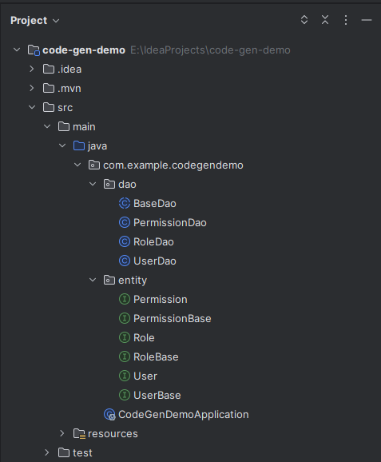

该插件是为jimmer设计的，目的是生成表对应的实体接口以及dao层，当前只适配了mysql数据库，后续会适配oracle数据库。
H2、Postgres不了解，SqlServer只在16年实习时使用过，所以该3种数据库暂时没有适配的计划。
如果有用户反馈确实需要的话，可以联系我适配。

以下为一个使用该插件的示例：

```xml
  <build>
        <plugins>
            <plugin>
                <groupId>io.github.tokgoronin</groupId>
                <artifactId>jimmerCodeGen-maven-plugin</artifactId>
                <version>0.0.3</version>
                <configuration>
                    <!-- jdbc配置，必选项 -->
                    <jdbcConfig>
                        <driver>com.mysql.jdbc.Driver</driver>
                        <url>jdbc:mysql://localhost:3306/databaseName?characterEncoding=utf-8&amp;useSSL=false&amp;allowMultiQueries=true</url>
                        <username>username</username>
                        <password>password</password>
                    </jdbcConfig>
                    
                    <!-- 需要生成的表，如果不写的话，默认生成所有的表 -->
                    <tables>
                        <table>d_role</table>
                        <table>d_user</table>
                        <table>d_permission</table>
                    </tables>

                    <!-- 忽略表前缀 -->
                    <tablePrefix>d_</tablePrefix>
                    <!-- 是否生成dao -->
                    <daos>true</daos>
                    
                    <!-- 
                        这两个配置联合起来决定最终生成的文件存放路径，注：src前不要加/
                        该示例中，最终生成的代码路径为：
                        entity: /src/main/java/com/example/codegendemo/entity
                        dao: /src/main/java/com/example/codegendemo/dao
                    -->
                    <!-- 生成的文件存放的路径 -->
                    <sourcePath>src/main/java/</sourcePath>
                    <!-- 生成的文件存放的包名 -->
                    <packagePath>com.example.codegendemo</packagePath>
                </configuration>
            </plugin>
        </plugins>
    </build>

```
运行该插件后生成的目录如下：



注意事项：

1. 每张表生成的entity为2个接口，xxxBase接口每次生成时不会覆盖，用于编写关联关系、公用的属性等。
xxx继承xxxBase，每次生成会覆盖xxx，所以不要修改xxx，否则每次生成前，自行保存修改。
2. 如果配置了`<daos>true</daos>`则会生成对应的dao，其中BaseDao是一个抽象类，包含了基础的增删改查等操作，以及一个抽象接口：
``` java
public abstract List<E> findAllByPage(Class<T> entityTableClazz, int page, int size);
```
其他dao继承自BaseDao，自动生成时会自动实现该方法，但该方法目前很简陋，后续可能会有改动或删除。